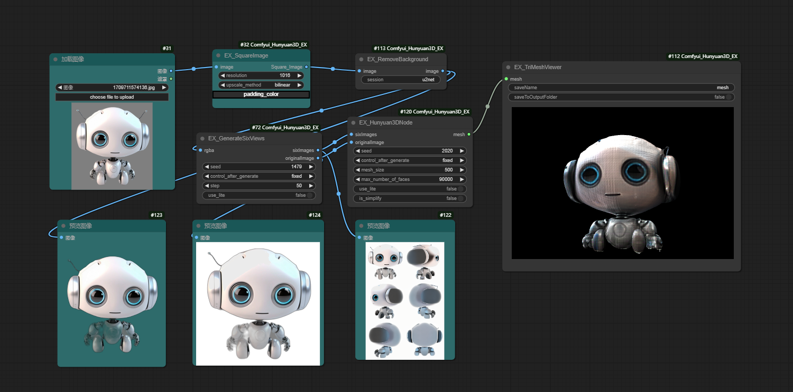

[English](README.md) | [简体中文](README_zh_CN.md)

# ComfyUI_Hunyuan3D_EX

The plugin mainly does some code optimization:
1. Optimized the internal code of Huyuan 3D, completely removed the Pytorch3d-related code and optimized it to Trimesh, which is a simple library to install. `Note: Deleted the function of exporting animations and textures, which I think is very simple for 3D modelers.`
2. Display part, considering that ComfyUI-3D-Pack library is very difficult to install, I optimized a version of the 3D display node based on ComfyUI-Flowty-TripoSR, which should solve most of the problems. However, I only tested it in my environment, so please feedback if there are any issues.
3. For the ComfyUI-run node of Huyuan 3D from Tencent, I optimized the running code of ComfyUI_Huyuan3D author.

#### Specific nodes：

- **EX_Hunyuan3DNode**
1. **sixImages**: six view images, fixed size of 1024*1536, RGB format, Tencent Huyuan uses six view positions differently, if you want to use the six view images of other models, you need to convert them.
2. **originalImages**: original image, fixed size of 512*512, RGB format, it seems to have no effect on the model, adding it to the source code is a must, I don't know what it's used for during testing, it seems to have the same effect regardless of the image.
3. **mesh**: triMesh format 3D model.
4. **other**: other parameters, which are literally interpreted, enabling simplified model, and the maximum face number is useful.

- **EX_GenerateSixViews**
1. **rgba**: An RGBA image format, the size of which should be a rectangle, otherwise it will be distorted, and the size should be over 1024 pixels. `Comfyui itself has a function to mask an image to an RGBA image, which can be used to generate RGBA images.`
2. **sixImages**: Six view images, output, one image, fixed size of 1024*1536, RGB format.
3. **originalImages**: Original images, output, one image, fixed size of 512*512, RGB format.

- **EX_TriMeshViewer**
1. **mesh**: 3D model in triMesh format.
2. **other**: Other parameters, which are literal in meaning, are saved in the output folder.

- **EX_RemoveBackground**
A very simple background removal node, takes an image as input and outputs an image with the background removed. The model can be customized, and the specific model can be downloaded from the RemBg author's model download link.

- **EX_SquareImage**
The nodes created by ComfyUI_Huyuan3D author have not been adjusted.

## Work flow

## Reference materials
- [Tencent/Hunyuan3D-1](https://github.com/Tencent/Hunyuan3D-1) - A Unified Framework for Text-to-3D and Image-to-3D Generation
- [ComfyUI_Huyuan3D](https://github.com/TTPlanetPig/Comfyui_Hunyuan3D) - This is a custom node to support hunyuan3D in comfyui.
- [ComfyUI-Flowty-TripoSR](https://github.com/flowtyone/ComfyUI-Flowty-TripoSR) - This is a custom node that lets you use TripoSR right from ComfyUI.

